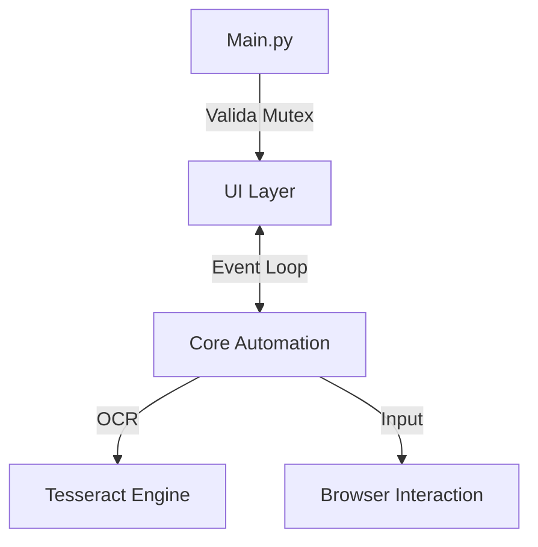

# Manual Técnico de Sustentação - AutoRewardsPC

**Versão do Documento:** 1.0
**Destinado a:** Desenvolvedores, Analistas de Suporte, DevOps e Infraestrutura
**Classificação:** Uso Interno / Corporativo

---

## Sumário Executivo

Este documento detalha a arquitetura, operação, manutenção e processos de build da aplicação AutoRewardsPC. O objetivo é fornecer subsídios técnicos para times de sustentação e infraestrutura garantirem a disponibilidade e evolução do software.

## 1. Visão Geral da Solução

### 1.1. Objetivo do Negócio

Automatizar a coleta de pontos no programa Microsoft Rewards através da simulação de interações humanas (RPA) no navegador Microsoft Edge.

### 1.2. Stack Tecnológico

| Componente              | Tecnologia / Versão                  |
| :---------------------- | :----------------------------------- |
| Linguagem Core          | Python 3.10+                         |
| Interface Gráfica (GUI) | CustomTkinter (CTK) 5.x              |
| Automação (RPA)         | PyAutoGUI, Selenium (Drivers Web)    |
| OCR (Motor de Texto)    | Tesseract OCR (Dependência Externa)  |
| Compilação/Build        | PyInstaller 6.x                      |
| Logs                    | Python Logging (RotatingFileHandler) |
| Controle de Instância   | Win32 API (Mutex Global)             |

## 2. Arquitetura de Software

### 2.1. Dependência Externa Crítica: Tesseract OCR

O sistema utiliza o Tesseract OCR para reconhecimento de texto. Este componente NÃO é embarcado no executável.

**Requisitos de Runtime:**

- Binário do Tesseract instalado no Host.
- Caminho padrão: `C:\Program Files\Tesseract-OCR\tesseract.exe`
- Variável de Ambiente (Opcional): `TESSERACT_PATH`

### 2.2. Diagrama de Componentes (Conceitual)



### 2.3. Estrutura de Diretórios

- **src/main.py:** Ponto de entrada.
- **src/ui/app.py:** Controlador principal da UI.
- **src/core/automation.py:** Lógica funcional da automação.
- **src/domain/:** DTOs e constantes globais.

## 3. Configuração de Ambiente (Onboarding)

**Pré-requisitos:** Python 3.10+, Git Client, Virtualenv.

**Setup Inicial:**

```bash
git clone <repo_url>
cd AutoRewardsPC
python -m venv .venv
.\.venv\Scripts\activate
pip install -r requirements.txt
```

## 4. Build e Distribuição (DevOps)

A aplicação é distribuída como um binário standalone para Windows.

### 4.1. Processo de Build

O script `build.py` trata hooks de dependências, coleta de assets e limpeza.

### 4.2. Gerando uma Release

```bash
python build.py
```

O artefato final será gerado em: `dist/AutoRewardsPC/AutoRewardsPC.exe`

## 5. Guia de Sustentação (L2/L3)

### 5.1. Logs e Auditoria

Logs rotativos na pasta `logs/`.
Formato: `YYYY-MM-DD HH:MM:SS - Nível - Mensagem`

### 5.2. Problemas Comuns e Soluções

| Sintoma / Erro                                     | Procedimento de Correção                                                                  |
| :------------------------------------------------- | :---------------------------------------------------------------------------------------- |
| Erro "Failed to start embedded python interpreter" | Build corrompida. Limpar pastas "dist" e "build", rodar build novamente.                  |
| Aplicação não abre (Silent Fail)                   | Verificar processo "preso" no Task Manager (Mutex "Global\AutoRewardsPC_Instance_Mutex"). |
| Erro "Tesseract Not Found"                         | Instalar Tesseract OCR e conferir caminho.                                                |
| Clicks desalinhados                                | Executar Calibração. Verificar DPI scaling (100%).                                        |

## 6. Manutenção Evolutiva

Para adicionar novos passos de automação:

1. Mapeie o elemento no `app.py`.
2. Adicione a lógica em `core/automation.py`.
3. Gere nova build.

---

_assinada por **David Wallace Marques Ferreira** - Engenheiro Sênior_
